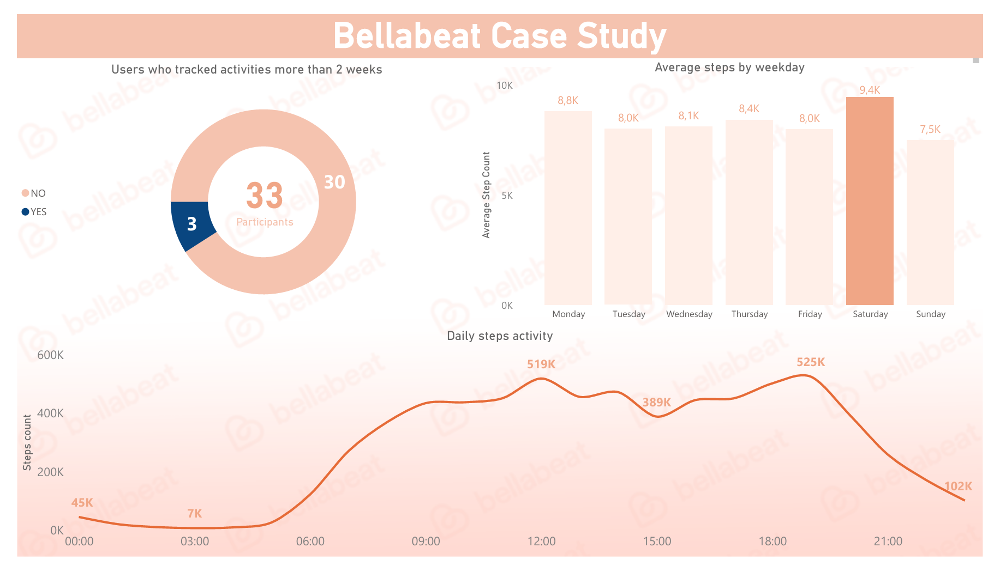
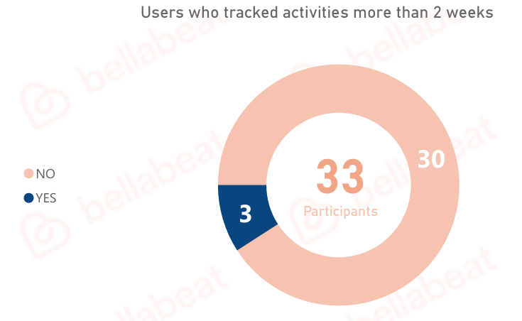
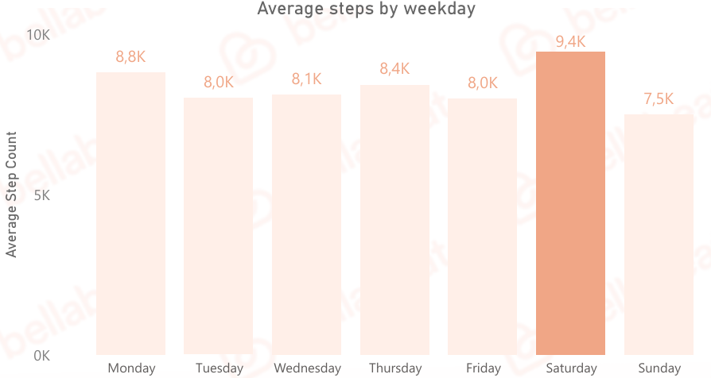
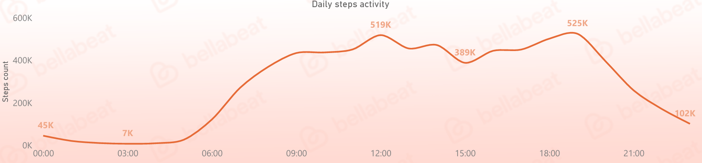
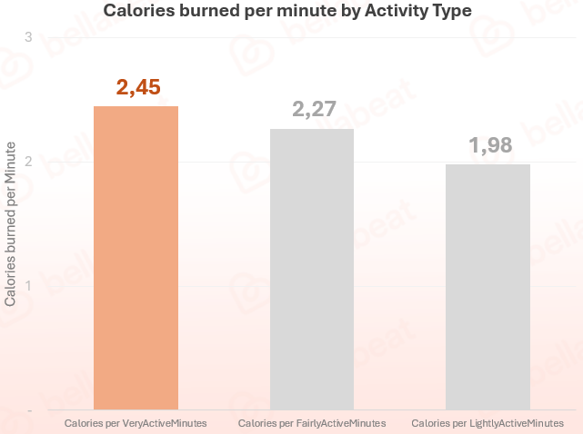

# Bellabeat Case Study
---
## Executive Summary:
Dieses Projekt analysiert Fitbit-Nutzerdaten, um wichtige Nutzungsmuster und Insights für Bellabeat zu identifizieren.  
Die Analyse wurde in Excel durchgeführt, während die Visualisierung der Trends über Power BI Dashboards erfolgte.  
Die finalen Ergebnisse umfassen eine Präsentation sowie einen Report mit konkreten Empfehlungen zur Unterstützung von Bellabeats Geschäftsentscheidungen, wie zum Beispiel:  
1. Hochintensive Aktivitäten in Marketingkampagnen hervorheben, um Zeiteffizienz und gesundheitliche Vorteile zu betonen.
2. Einführung eines wöchentlichen **Challenge-Reward Programms**, mit Anreizen wie **10–20%** Rabatt auf Bellabeat Produkte oder Mitgliedschaften.
3. Versand von zeitlich abgestimmten **(17:30–19:00)** täglichen Erinnerungen und motivierenden Nachrichten, um Gewohnheiten zu fördern, die Aktivitätsverfolgung zu verbessern und die Kundenbindung zu stärken. 

### Aufgabe:
Analysiere Fitbit-Smart-Gerät-Nutzungsdaten, um zu verstehen, wie Konsumenten Smart Geräte verwenden.  

  
*Bild 1*  

### Methodologie:
1. Datensatz heruntergeladen, entpackt und Rohdaten in Excel importiert
2. Relevante Datensätze für die Analyse ausgewählt und identifiziert
3. Daten in Excel bereinigt und transformiert
4. Nutzeraktivitäten und Gewohnheiten in Excel analysiert und ein Dashboard in Power BI erstellt
5. Präsentation und finalen Report mit den wichtigsten Insights und Empfehlungen erstellt

### Fähigkeiten:
    Excel: Datenbereinigung, Pivot-Tabellen, Visualisierungen, Trendanalyse
    Power BI: Dashboard Erstellung und Datenvisualisierung
    PowerPoint: Klare, verständliche Präsentationen mit Fokus auf Key Insights
    Jupyter Notebook: Markdown Dokumentation

### Ergebnisse und Empfehlungen:
Die Analyse der Fitbit-Nutzerdaten hat gezeigt, dass viele Nutzer Schwierigkeiten haben, Motivation aufrechtzuerhalten und konsistente Aktivitätsgewohnheiten zu entwickeln.  
Außerdem zeigen die Insights, dass der frühe Abend die motivierendste Tageszeit ist und Samstag der aktivste Tag der Woche ist.  

Zudem wurde deutlich, dass hochintensive Aktivitäten mehr Kalorien verbrennen und damit deutlich zeiteffizienter sind als Aktivitäten mit niedriger Intensität.

*90% der Nutzer sind nach 2 Wochen abgesprungen* 
  
*Bild 2*  

---

*Nutzer waren aktivsten am samstags*  
  
*Bild 3*  

---

*Der frühe Abend war die aktivste Tageszeit*  
  
*Bild 4*   

---

*Die Bedeutung von hochintensiven Aktivitäten*  
  
*Bild 5*  

---

Obwohl Fitbit Nutzer generell Schwierigkeiten mit Motivation haben, zeigen die Daten klar, dass der frühe Abend und Samstage die motivierendsten Zeiten für Aktivität sind. Außerdem bieten hochintensive Workouts eine zeiteffiziente Lösung, was gezielt genutzt werden kann, um die Ziele von Bellabeat zu unterstützen.  
Basierend auf diesen Insights empfehle ich folgende strategische Maßnahmen:  
1. Hochintensive Aktivitäten in Kampagnen hervorheben, um Zeiteffizienz und gesundheitliche Vorteile zu betonen
2. Einführung eines wöchentlichen **Challenge-Reward-Programms** mit Anreizen von **10–20%** Rabatt auf Bellabeat-Produkte oder Mitgliedschaften
3. Versand von zeitlich abgestimmten **(17:30–19:00)** täglichen Erinnerungen und motivierenden Nachrichten, um Gewohnheiten zu fördern, Aktivität zu tracken und die Kundenbindung zu stärken

Ich bin überzeugt, dass diese Maßnahmen das Nutzer Engagement, die Gesundheit der Nutzer sowie Mitgliedschaften, Sales und Umsatz für Bellabeat steigern können.  

### Nächste Schritte:
1. Zusätzliche Nutzerdaten sammeln (z. B. Alter, Geschlecht, Lifestyle etc.)
2. 15 tägige Premium-Free-Trial einführen
3. A/B-Testing für Marketingkampagnen durchführen (verschiedene Angebote testen, um die beste Retention zu finden)
4. Events sowie saisonale und Wetter Einflüsse analysieren
5. Dashboard für kontinuierliches Tracking aufbauen
